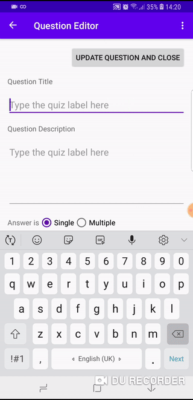
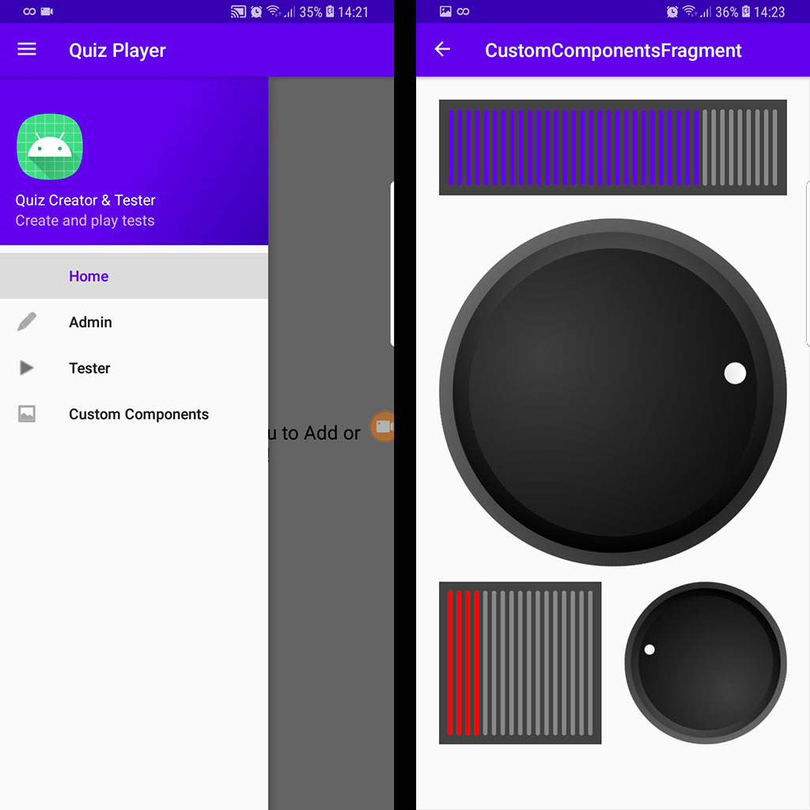
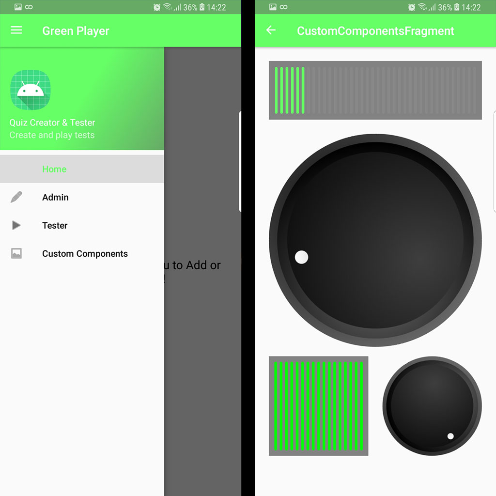
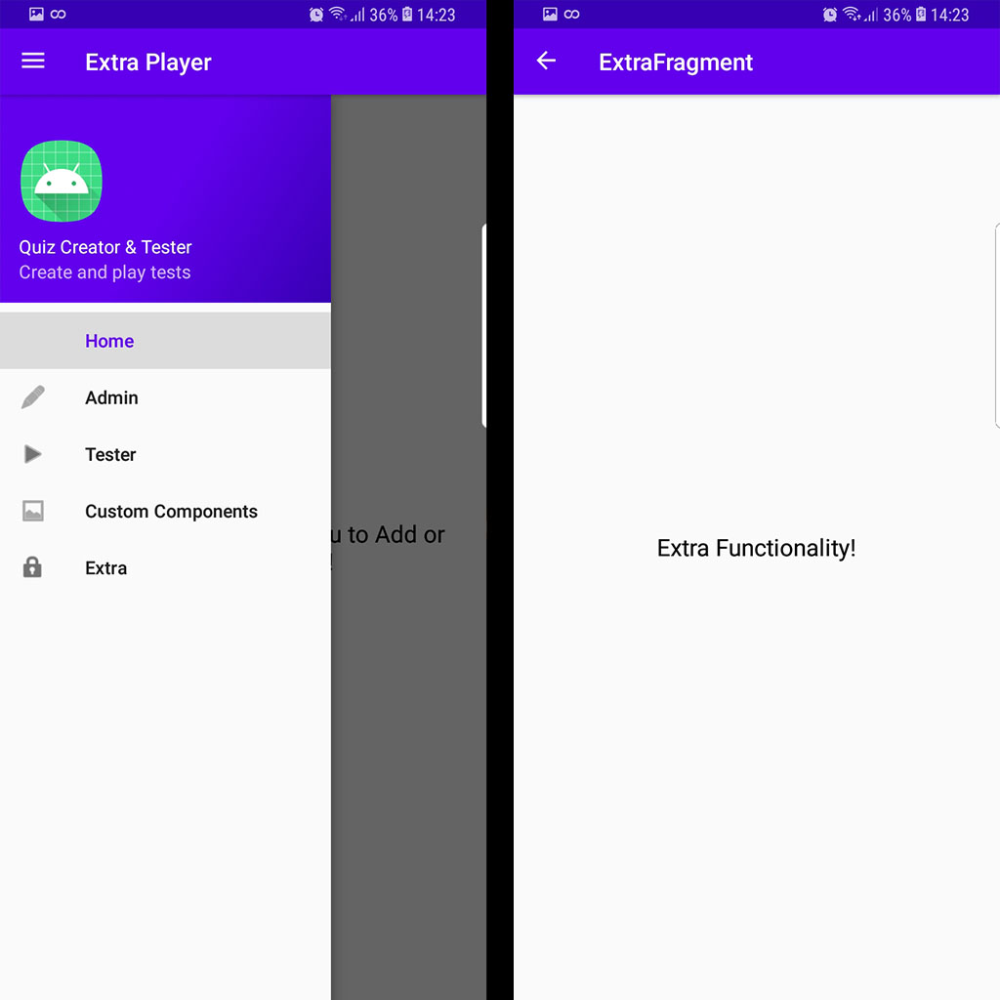
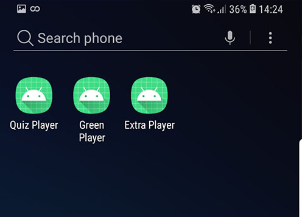

# quiz_editor_and_player

----------



## Notes on Branch: White label with Custom UI

### Custom UI Components

This branch was added to show case the use of 2 custom UI components found in:
app/com/phinnovation/quizplayer/presentation/components/

The first, RotaryKnobComponent, is adapted from the work of Oren Geva
(https://www.freecodecamp.org/news/how-to-create-an-android-rotary-knob-using-kotlin/),
with some refactoring to allow for the Knob to fit its container view and do not
depend on hardcoded dimens values. The knob value interface based callback was also replaced
by a closure.

This component is extending a FrameLayout in order to allow for a rotatable,
ImageView to be placed inside it.

The second component, VUMeterComponent was implemented from scratch and show cases a lower level
custom component creation, via extending View this time.

Here, all measurement and drawing is done in code via canvas paint calls.

An additional screen/fragment was added to the application
(app/com/phinnovation/quizplayer/presentation/screens/customcomponents/CustomComponentFragment)

in order to display and connect these 2 components.

The VUMeter at the top of the screen responds to the large Rotary knob bellow,
while, the second smaller VUMeter is connected to the knob on the right to it.



### White Labeling - Flavors and dimensions

To show case multiple apps per project (White Labeling) some modifications were made to the app's
build.grandle

A flavorDimensions 'client' was added with the following productFlavors:

1.  default - The original (purple based) Quiz Editor and Player App.
            - package: com.phinnovation.quizplayer.presentation.application.QuizPlayerApplication
            - build apk: app-default-debug.apk
            - sources in: src/main/ java & res


2.  green - The original (purple based) app dressed in Green.
            - package: com.phinnovation.quizplayer.presentation.application.GreenQuizPlayer
            - build apk: app-green-debug.apk
            - overriding resources in src/green/res



3.  extra - The original (purple based) app with added functionality (an extra screen).
            - package: com.phinnovation.quizplayer.presentation.application.ExtraQuizPlayer
            - build apk: app-extra-debug.apk
            - overriding resources (new menu with added extra screen) in src/extra/res
            - new fragment/screen source in src/extra/java



Building all targets now results in 3 debug and 3 release apps each having their own
package and application name and can thus be installed next to each other, on the same device:



Off course in a real project the app icons would also be overridden / different per app.

----------

## Research / Prototype on Android Jetpack components and CLEAN architecture

A Quiz Application that allows for quiz creation (containing any number of questions) and testing.

A user can go to the admin area and create a number of quizes and their questions.

Same user can then play test these quizzes to completion (or not, resuming is supported).

## Intro

A Single Activity / Multi Fragment approach (fully rotatable) using:

1.  Google's Jetpack Navigation and its Navigation Graph (similar to a storyboard), NavHost container
    and NavController for easy semi automatic fragment management without having to manually use the 
    fragment manager for fragment replacement and so on
    
2.  Jetpack's SQlite database Rooms, also tested via integration testing both as raw Room daos and as Repositories
    Check androidTest folder

3.  Fragments get their state via their viewmodels and the associated data stores
    no need for passing arguments/bundles between fragments and returning values
    
4.  LiveData is used to propagate changes from the viewmodel to fragment observers

5.  Drawer based navigation between the home page, the admin page and the tester page

6.  CLEAN based architecture    

### Further notes

1.  In general fragments notify (via a delegate) their parent Activity for actions. 
2.  In one case (QuizPlaying) the Activity delegates its back action to the corresponding fragment, 
    so the user can (via an alert) to cancel or continue the quiz without exiting. This Fragment implements
    a relevant interface, and the main activity when receiving back events always checks with its children 
    before continuing with the back action
3.  In some views multiple live data objects are exposed from their viewmodels

## Project Structure and notes

The architecture is based (and extended) on Ivan Kušt's article on Android and CLEAN arch (raywenderlich.com)

The application is split in two modules:

1.  The "app" module that contains code Android related functionality, that is the framework and the presentation
    layers of the architecture

2.  The module named "core" that contains the Data, Use Case and Domain layers of the architecture

### Core Module

The core module is further devided into 3 packages:

1.  data
2.  domain
3.  interactors

#### domain package / layer

Contains the 2 models / beans that our app will be using:

1.  Quiz 
2.  Question

#### data package / layer

This package contains abstract definitions for accessing sources such as the database or the internet.
In this app we have used the repository pattern and thus in this package related classes can be found:

Datasource interfaces: The interfaces that the Framework layer must implement
Repository classes: Provide methods for accessing the data that delegate to DataSource

We also define 2 in memory datasources without related repositories responsible for accessing a Quiz and/or Question from 
memory 

#### interactors package (Use Case Layer)

Contains 1 class for each use case of the Application, at the moment 12 Use Cases including for example:

1.  AddQuestion
2.  RemoveQuestion
3.  GetQuestions
4.  GetOpenQuestion (get question from the in memory data source)

and so on

All of these have only one function that invokes the use case and are implemented similar to this:

```
class AddQuestion(private val questionRepository: QuestionRepository) {
    suspend operator fun invoke(quiz: Quiz, question:Question) =
        questionRepository.addQuestion(quiz,question)
}
```

For convenience, we are  overloading the invoke operator. This enables us to simplify the function call on AddQuestion instance to addQuestion() instead of addQuestion.invoke().

### App Module

The App module is further divided into 2 packages:

1.  framework
2.  presentation

#### Framework package

Contains implementations of interfaces defined in the data layer.

As an example RoomQuizDataSource is a concrete implementation of QuizDataSource using Google's Jetpack SQLite based component Rooms

We also need a way to provide the Data Sources to the data layer,

Initially instead of Dependency Injection, the application, its repositories and Interactors were
'injected' inside the QuizPlayerApplication class, where its repositories were initialized and the
Interactors class was 'injected' to the  QuizPlayerViewModelFactory class which is responsible for
creating our QuizPlayerViewModel instances.

Dagger2 in now used to provide data sources to the data layer, for more info check the classes inside
the package dagger, where a number of modules are declared and made available to the app via the
AppComponent class.

Now, inside the Fragment implementations, the viewModel factory is injected as here:
```
    @Inject
    lateinit var factory: ViewModelProvider.Factory
```

and the viewModel is provided via its factory:

```
    viewModel = ViewModelProvider(this, factory)[QuestionEditorViewModel::class.java]
```

injection is as simple as this (inside the fragments, onCreate):

```
    (activity?.application as QuizPlayerApplication).quizPlayerComponent.inject(this)
```

##### database packages

Contains Database and Rooms related needed classes, such as the Question and Quiz DAOs their entites and the Database itself

#### presentation package / layer

Contains out MainActivity and its Delegate as well as all the screens of the application separated in the following packages:

0.  application: the main App, its viewModel + Factory
1.  admin: admin related screens
2.  home: contains the initial/home fragment the user sees
3.  tester: quiz play/test related screens
4.  utils: 
    1.  FragmentReceiveOnBack: An interface for fragments to implement when needing to process back actions
    2.  RadioGroupCheckListener: A helper class that groups unrelated radio buttons into a single logical RadioGroup,
        and thus making selection on radio's deselect the rest
        
##### admin package

1.  QuizList screen 
    Displays the list of existing quizzes, the FAB at the bottom right can be used to add a new quiz
    Taping on the rows opens the QuizEditor Screen
    
2.  QuizEditor screen
    Can be used to update the title and description of the quiz as well as add questions to the quiz
    Tapping a question opens the QuestionEditor screen
    We can also remove the quiz from this screen via its options meny "Delete"    
           
3.  QuestioEditor screen
    Can be used to update the title and description of a question,
    the question type can be selected as single or multi, whereas the radio / checks bellow are switched to the correct version
    the question type is also changed here between its 2 enum values:     
        SINGLE_CHOICE(0),
        MULTI_CHOICE(1)
    the question editor currently checks before saving that at least a radio button or checkbox is selected in order for the 
    question to have a valid answer
    no checks for empty answer texts is currently done, but here would be the place to do so 
               

##### User / Tester package

1.  list screen: similar to admin list but shows icons depending on the state of the quiz:
    enum class QuizState (val code:Int){
        NOT_STARTED(0),
        STARTED(1),
        FINISHED(2)
    }

    Finished quizzes cannot be restarted and display an error Toast
    Started quizzes can be continued from the last question shown
    its quiz is first checked that it contains some questions and then started or display an error message for the admin to add some questions
    
2.  intro
    Shows the title and description of the started quiz and a button to start
    if the quiz was interrupted and thus continued here, the number of the next question is also shown
      
3.  player
    screen responsible for running a quiz
    when an answer is checked, the user sees a correct/false message before continuing to the next question
    if the question answered was the last, the button shows end quiz instead of next question